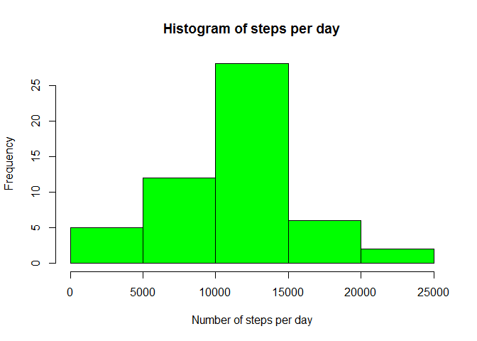
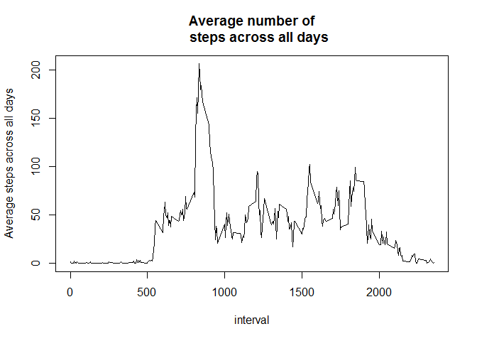
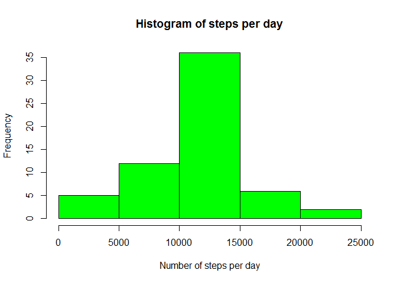

# Reproducible Research: Peer Assessment 1


## Loading and preprocessing the data

Load data

```r
tmp<-unzip("activity.zip")
tmp
```

```
## [1] "./activity.csv"
```

```r
data<- read.csv(tmp)
str(data)
```

```
## 'data.frame':	17568 obs. of  3 variables:
##  $ steps   : int  NA NA NA NA NA NA NA NA NA NA ...
##  $ date    : Factor w/ 61 levels "2012-10-01","2012-10-02",..: 1 1 1 1 1 1 1 1 1 1 ...
##  $ interval: int  0 5 10 15 20 25 30 35 40 45 ...
```

```r
head(data)
```

```
##   steps       date interval
## 1    NA 2012-10-01        0
## 2    NA 2012-10-01        5
## 3    NA 2012-10-01       10
## 4    NA 2012-10-01       15
## 5    NA 2012-10-01       20
## 6    NA 2012-10-01       25
```

Transform data

```r
data$date<- as.Date(data$date, "%Y-%m-%d")
str(data)
```

```
## 'data.frame':	17568 obs. of  3 variables:
##  $ steps   : int  NA NA NA NA NA NA NA NA NA NA ...
##  $ date    : Date, format: "2012-10-01" "2012-10-01" ...
##  $ interval: int  0 5 10 15 20 25 30 35 40 45 ...
```


## What is mean total number of steps taken per day?

Calculate the total number of steps taken per day

```r
library(plyr)
library(dplyr)
```

```
## 
## Attaching package: 'dplyr'
## 
## The following objects are masked from 'package:plyr':
## 
##     arrange, count, desc, failwith, id, mutate, rename, summarise,
##     summarize
## 
## The following objects are masked from 'package:stats':
## 
##     filter, lag
## 
## The following objects are masked from 'package:base':
## 
##     intersect, setdiff, setequal, union
```


```r
df1<- ddply(data,.(date),summarize, totalsteps = sum(steps))
df1
```

```
##          date totalsteps
## 1  2012-10-01         NA
## 2  2012-10-02        126
## 3  2012-10-03      11352
## 4  2012-10-04      12116
## 5  2012-10-05      13294
## 6  2012-10-06      15420
## 7  2012-10-07      11015
## 8  2012-10-08         NA
## 9  2012-10-09      12811
## 10 2012-10-10       9900
## 11 2012-10-11      10304
## 12 2012-10-12      17382
## 13 2012-10-13      12426
## 14 2012-10-14      15098
## 15 2012-10-15      10139
## 16 2012-10-16      15084
## 17 2012-10-17      13452
## 18 2012-10-18      10056
## 19 2012-10-19      11829
## 20 2012-10-20      10395
## 21 2012-10-21       8821
## 22 2012-10-22      13460
## 23 2012-10-23       8918
## 24 2012-10-24       8355
## 25 2012-10-25       2492
## 26 2012-10-26       6778
## 27 2012-10-27      10119
## 28 2012-10-28      11458
## 29 2012-10-29       5018
## 30 2012-10-30       9819
## 31 2012-10-31      15414
## 32 2012-11-01         NA
## 33 2012-11-02      10600
## 34 2012-11-03      10571
## 35 2012-11-04         NA
## 36 2012-11-05      10439
## 37 2012-11-06       8334
## 38 2012-11-07      12883
## 39 2012-11-08       3219
## 40 2012-11-09         NA
## 41 2012-11-10         NA
## 42 2012-11-11      12608
## 43 2012-11-12      10765
## 44 2012-11-13       7336
## 45 2012-11-14         NA
## 46 2012-11-15         41
## 47 2012-11-16       5441
## 48 2012-11-17      14339
## 49 2012-11-18      15110
## 50 2012-11-19       8841
## 51 2012-11-20       4472
## 52 2012-11-21      12787
## 53 2012-11-22      20427
## 54 2012-11-23      21194
## 55 2012-11-24      14478
## 56 2012-11-25      11834
## 57 2012-11-26      11162
## 58 2012-11-27      13646
## 59 2012-11-28      10183
## 60 2012-11-29       7047
## 61 2012-11-30         NA
```

Make a histogram of the total number of steps taken each day

```r
par(mfrow=c(1,1))
hist(df1$totalsteps, col= "Green" , xlab = "Number of steps per day", main="Histogram of steps per day")
```

 

Calculate and report the mean and median of the total number of steps taken per day.

```r
mean<- mean(df1$totalsteps, na.rm = TRUE)
mean
```

```
## [1] 10766.19
```

```r
median<- median(df1$totalsteps, na.rm = TRUE)
median
```

```
## [1] 10765
```

So, the mean of the total number of steps taken per day is 1.0766189\times 10^{4} and the median is 10765.


## What is the average daily activity pattern?

Make a time series plot (i.e. type = "l") of the 5-minute interval (x-axis) and the average number of steps taken, 
averaged across all days (y-axis)

```r
averagesteps<- ddply(data,.(interval),summarize, mean = mean(steps, na.rm = TRUE))
head(averagesteps)
```

```
##   interval      mean
## 1        0 1.7169811
## 2        5 0.3396226
## 3       10 0.1320755
## 4       15 0.1509434
## 5       20 0.0754717
## 6       25 2.0943396
```

```r
with(averagesteps, plot(interval, mean, ylab="Average steps across all days", type="l", main="Average number of
    steps across all days"))
```

 


Which 5-minute interval, on average across all the days in the dataset, contains the maximum number of steps?

```r
averagesteps[averagesteps$mean==max(averagesteps$mean),]
```

```
##     interval     mean
## 104      835 206.1698
```

So, in the interval 835 or 08:35AM-08:40AM is the maximum number of steps across all days.  
It is logical to think that because in this interval a lot of people go to work,that's why the maximum is in here.

## Imputing missing values

Calculate and report the total number of missing values in the dataset (i.e. the total number of rows with NAs)

```r
colSums(is.na(data))
```

```
##    steps     date interval 
##     2304        0        0
```
We see that only in the column steps there are NA's.

```r
totalNA<- sum(is.na(data$steps))
```
The total number of rows with missing values in the dataset is 2304.


My strategy for filling in all of the missing values in the dataset would be to use the average number 
of steps for each interval to fill in the NAs.

To create a new dataset that is equal to the original dataset but with the missing data filled in,
first I will try to create a new column in the orignal data frame which contains the mean for each interval.

```r
df3<- arrange(join(data,averagesteps),interval)
```

```
## Joining by: interval
```

```r
head(df3)
```

```
##   steps       date interval     mean
## 1    NA 2012-10-01        0 1.716981
## 2     0 2012-10-02        0 1.716981
## 3     0 2012-10-03        0 1.716981
## 4    47 2012-10-04        0 1.716981
## 5     0 2012-10-05        0 1.716981
## 6     0 2012-10-06        0 1.716981
```

Now, I want to sort the data frame by date and then by interval.

```r
df3<- arrange(df3, date, interval)
head(df3)
```

```
##   steps       date interval      mean
## 1    NA 2012-10-01        0 1.7169811
## 2    NA 2012-10-01        5 0.3396226
## 3    NA 2012-10-01       10 0.1320755
## 4    NA 2012-10-01       15 0.1509434
## 5    NA 2012-10-01       20 0.0754717
## 6    NA 2012-10-01       25 2.0943396
```

```r
str(df3)
```

```
## 'data.frame':	17568 obs. of  4 variables:
##  $ steps   : int  NA NA NA NA NA NA NA NA NA NA ...
##  $ date    : Date, format: "2012-10-01" "2012-10-01" ...
##  $ interval: int  0 5 10 15 20 25 30 35 40 45 ...
##  $ mean    : num  1.717 0.3396 0.1321 0.1509 0.0755 ...
```

I added the column mean to the original data frame.  
My plan is to change the NA values with the mean values for that interval. Because the mean column has numerical values  
and steps column has integer values, I will transform the steps column from an integer vector to a numerical vector.

```r
df3$steps<- as.numeric(df3$steps)
str(df3)
```

```
## 'data.frame':	17568 obs. of  4 variables:
##  $ steps   : num  NA NA NA NA NA NA NA NA NA NA ...
##  $ date    : Date, format: "2012-10-01" "2012-10-01" ...
##  $ interval: int  0 5 10 15 20 25 30 35 40 45 ...
##  $ mean    : num  1.717 0.3396 0.1321 0.1509 0.0755 ...
```
And now I will change the NA values with the mean values.

```r
df3$steps[is.na(df3$steps)]<- df3$mean[is.na(df3$steps)]
head(df3)
```

```
##       steps       date interval      mean
## 1 1.7169811 2012-10-01        0 1.7169811
## 2 0.3396226 2012-10-01        5 0.3396226
## 3 0.1320755 2012-10-01       10 0.1320755
## 4 0.1509434 2012-10-01       15 0.1509434
## 5 0.0754717 2012-10-01       20 0.0754717
## 6 2.0943396 2012-10-01       25 2.0943396
```
Finally, I will remove the mean column.

```r
newdata<- select(df3, - mean)
head(newdata) 
```

```
##       steps       date interval
## 1 1.7169811 2012-10-01        0
## 2 0.3396226 2012-10-01        5
## 3 0.1320755 2012-10-01       10
## 4 0.1509434 2012-10-01       15
## 5 0.0754717 2012-10-01       20
## 6 2.0943396 2012-10-01       25
```

Make a histogram of the total number of steps taken each day and calculate and report the mean   
and median total number of steps taken per day.

```r
df4<- ddply(newdata,.(date),summarize, totalsteps = sum(steps))
df4
```

```
##          date totalsteps
## 1  2012-10-01   10766.19
## 2  2012-10-02     126.00
## 3  2012-10-03   11352.00
## 4  2012-10-04   12116.00
## 5  2012-10-05   13294.00
## 6  2012-10-06   15420.00
## 7  2012-10-07   11015.00
## 8  2012-10-08   10766.19
## 9  2012-10-09   12811.00
## 10 2012-10-10    9900.00
## 11 2012-10-11   10304.00
## 12 2012-10-12   17382.00
## 13 2012-10-13   12426.00
## 14 2012-10-14   15098.00
## 15 2012-10-15   10139.00
## 16 2012-10-16   15084.00
## 17 2012-10-17   13452.00
## 18 2012-10-18   10056.00
## 19 2012-10-19   11829.00
## 20 2012-10-20   10395.00
## 21 2012-10-21    8821.00
## 22 2012-10-22   13460.00
## 23 2012-10-23    8918.00
## 24 2012-10-24    8355.00
## 25 2012-10-25    2492.00
## 26 2012-10-26    6778.00
## 27 2012-10-27   10119.00
## 28 2012-10-28   11458.00
## 29 2012-10-29    5018.00
## 30 2012-10-30    9819.00
## 31 2012-10-31   15414.00
## 32 2012-11-01   10766.19
## 33 2012-11-02   10600.00
## 34 2012-11-03   10571.00
## 35 2012-11-04   10766.19
## 36 2012-11-05   10439.00
## 37 2012-11-06    8334.00
## 38 2012-11-07   12883.00
## 39 2012-11-08    3219.00
## 40 2012-11-09   10766.19
## 41 2012-11-10   10766.19
## 42 2012-11-11   12608.00
## 43 2012-11-12   10765.00
## 44 2012-11-13    7336.00
## 45 2012-11-14   10766.19
## 46 2012-11-15      41.00
## 47 2012-11-16    5441.00
## 48 2012-11-17   14339.00
## 49 2012-11-18   15110.00
## 50 2012-11-19    8841.00
## 51 2012-11-20    4472.00
## 52 2012-11-21   12787.00
## 53 2012-11-22   20427.00
## 54 2012-11-23   21194.00
## 55 2012-11-24   14478.00
## 56 2012-11-25   11834.00
## 57 2012-11-26   11162.00
## 58 2012-11-27   13646.00
## 59 2012-11-28   10183.00
## 60 2012-11-29    7047.00
## 61 2012-11-30   10766.19
```

```r
hist(df4$totalsteps, col= "Green" , xlab = "Number of steps per day", main="Histogram of steps per day")
```

 
  
I calculate the new mean and the new median.

```r
newmean<- mean(df4$totalsteps)
newmean
```

```
## [1] 10766.19
```

```r
newmedian<- median(df4$totalsteps)
newmedian
```

```
## [1] 10766.19
```
So, the new mean of the total number of steps taken per day is 1.0766189\times 10^{4} and the new median is 1.0766189\times 10^{4}.  
We can see that the new values do not differ from the first ones.  


## Are there differences in activity patterns between weekdays and weekends?

I will create a new factor variable in the dataset with two levels - "weekday" and "weekend" indicating whether a given date 
is a weekday or weekend   
First of all, my system needs the Sys.setlocale command in order to translate days in english.

```r
Sys.setlocale("LC_ALL", "English")
```
I will use the ifelse command to create a character vector and then I will transform it to a categorical variable.

```r
newdata$day<- ifelse(weekdays(newdata$date) %in% c("Saturday","Sunday"), "weekend", "weekday")
newdata$day<- factor(newdata$day)
head(newdata)
```

```
##       steps       date interval     day
## 1 1.7169811 2012-10-01        0 weekday
## 2 0.3396226 2012-10-01        5 weekday
## 3 0.1320755 2012-10-01       10 weekday
## 4 0.1509434 2012-10-01       15 weekday
## 5 0.0754717 2012-10-01       20 weekday
## 6 2.0943396 2012-10-01       25 weekday
```

I will make a panel plot containing a time series plot of the 5-minute interval and the average number of steps taken, 
 averaged across all weekday days or weekend days.

```r
library(lattice)
dff<-ddply(newdata,.(interval,day),summarize, mean=mean(steps))
head(dff)
```

```
##   interval     day       mean
## 1        0 weekday 2.25115304
## 2        0 weekend 0.21462264
## 3        5 weekday 0.44528302
## 4        5 weekend 0.04245283
## 5       10 weekday 0.17316562
## 6       10 weekend 0.01650943
```

```r
xyplot(mean~interval | day, data=dff, ylab="Average number of steps", type="l", layout=c(1,2))
```

 


